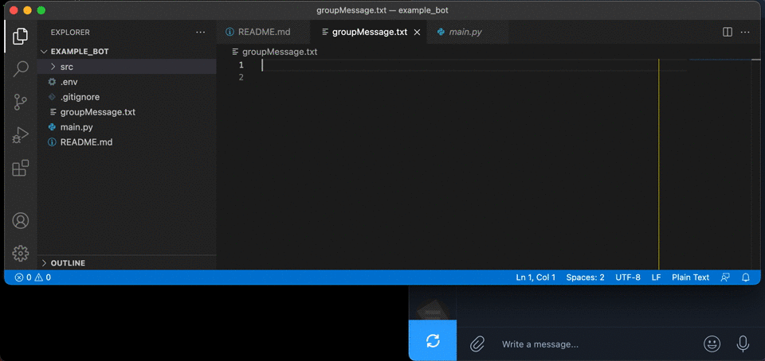

# Telegram Bot & Group Chats messages through python

## Description
This project guides you through on how to :
1. Build a simple Telegram Bot and then
1. Use a python script to send a predefined and preformatted message in all Telegram group chats that the bot is added.

## Prerequisites
1. Install `python3` (if you already have `brew` you can use `brew install python3` to install it)
1. Install `pip3` (if you already have `brew` you can use `brew install pip3` to install it)
1. Install `virtualenv` with `pip3 install virtualenv`

## Steps to setup & run
- `git clone` this repo
- `cd telegram-bot`
- create a new virtual environment with a name of your choice (e.g. `env-telegram-bot`) by typing the following command :
    ```
    virtualenv env-telegram-bot
    ```
- activate the virtual environment you just created with the command :
    ```
    source env-telegram-bot/bin/activate
    ```
- use command `pip3 install -r requirements.txt` to install all required packages.

### Telegram Bot Setup
1. Download and install locally the [Telegram Desktop App](https://desktop.telegram.org/)
1. Talk to Botfather & create your first bot
    - Note: You can follow the steps described in the guide [How to Create and Connect a Telegram Chatbot](https://sendpulse.com/knowledge-base/chatbot/create-telegram-chatbot).
1. Copy the API Token of your bot
   - Note : if you already have a bot, you can write `/mybots` to BotFather and it will return the name of your bot. Then you can click on button `API Token` and it will return the corresponding token.
1. Create an `.env` file in the root folder of this project/repository (folder `telegram-bot`). You can do that with command the `touch .env` command.
1. Open your `.env` file and your token of your bot. The contents of your `.env` file should look like the following example :
    ```
    API_KEY = "110201543:AAHdqTcvCH1vGWJxfSeofSAs0K5PALDsaw"
    ```
1. Create at least one group chat in your telegram app and add your telegram bot. In this chat a message will be send from the bot through this python script (the script that will be executed in the "Run script" step).

### Update Group Message file
1. You can edit the contents of the file `groupMessage.txt`(located in the `files` directory) and add the text of your choice.
1. You can format it as `Markdown` or `HTML` by using the tags mentioned [here](https://core.telegram.org/bots/api#markdownv2-style) and [here](https://core.telegram.org/bots/api#html-style) respectively.

### Add the Group Chats file
1. You can add the group chats that you want to send the message to in the file `groups.txt`(located in the `files` directory).
1. The format should be `-TelegramChatID, TelegramChatName`, e.g. `-123456789, MyGroupChatName`.
1. If you have multiple group chats you would like to send the message to, you can add them in new lines.

### Run script
1. While in the root directory of this project, run command `python3 main.py` (from the terminal).
1. Check in the corresponding Telegram chats if the message was posted successfully and with the expected formatting.
1. When you are finished with the script, you can deactivate the virtual environment with the command :
    ```
    deactivate
    ```


## Resources
- [Telegram Bot - how to get a group chat id?](https://stackoverflow.com/questions/32423837/telegram-bot-how-to-get-a-group-chat-id)
    - `https://api.telegram.org/bot<YourBOTToken>/getUpdates`

## Troubleshooting
- If you execute the script and no messages are posted in the chat
    - Check if the formatted text has opening and closing tags
    - Get the whole command and paste it directly from your browser
    - if there is an error it will

## Short Walkthrough gif

