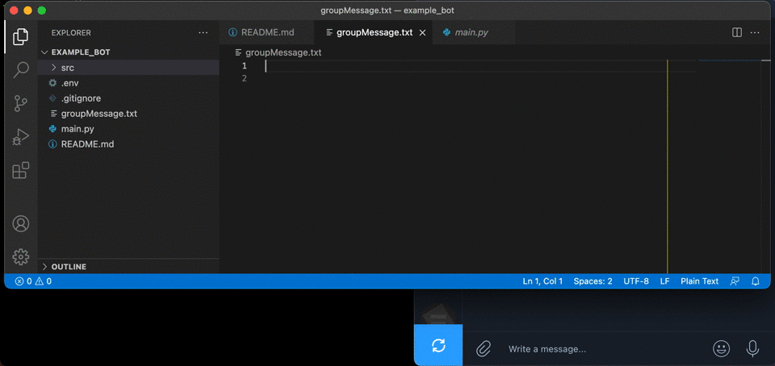

# Telegram Group Messaging Bot

## Overview

This project provides a Python CLI tool for broadcasting a predefined, HTML-formatted message to multiple Telegram group chats via the Telegram Bot API. It includes optional Excel-based tracking of send results for auditing and record-keeping purposes.

The workflow consists of four main capabilities:

1. **Bot Setup**: Creating and configuring a Telegram bot through BotFather.
2. **Multi-Channel Formatting**: Authoring a message once in Markdown and generating Telegram, Element, Slack, and email versions with a single command.
3. **Message Broadcasting**: Sending a formatted message to all designated Telegram group chats in a single execution.
4. **Result Tracking**: Recording delivery outcomes (success/failure) in an Excel spreadsheet.

## Prerequisites

- **Python 3** — Install via [python.org](https://www.python.org/) or Homebrew (`brew install python3`)
- **pip3** — Typically bundled with Python 3; otherwise install via Homebrew (`brew install pip3`)
- **virtualenv** — Install with `pip3 install virtualenv`

## Setup Instructions

1. Clone the repository:
    ```
    git clone <repository-url>
    cd telegram-bot
    ```

2. Create and activate a virtual environment:
    ```
    virtualenv env-telegram-bot
    source env-telegram-bot/bin/activate
    ```

3. Install the required dependencies:
    ```
    pip3 install -r requirements.txt
    ```

### Telegram Bot Configuration

1. Download and install the [Telegram Desktop App](https://desktop.telegram.org/).
2. Create a new bot by messaging [BotFather](https://t.me/botfather) on Telegram.
    - Refer to the guide [How to Create and Connect a Telegram Chatbot](https://sendpulse.com/knowledge-base/chatbot/create-telegram-chatbot) for detailed instructions.
3. Obtain the API token for your bot.
    - If you already have a bot, send `/mybots` to BotFather, select the bot, and click **API Token** to retrieve it.
4. Create a `.env` file in the project root directory:
    ```
    touch .env
    ```
5. Add your bot token to the `.env` file in the following format:
    ```
    API_KEY = "110201543:AAHdqTcvCH1vGWJxfSeofSAs0K5PALDsaw"
    ```
6. Create at least one Telegram group chat and add your bot as a member. This group will receive the message when the script is executed.

### Configuring the Message

Write the message once in `files/message.md` (Markdown) and generate the Telegram version with `python3 format_message.py` — see [Generating Multi-Channel Formats](#generating-multi-channel-formats) below. The bot reads the generated `files/out/telegram.html`.

The Telegram output uses HTML formatting as documented in the [Telegram Bot API - HTML style](https://core.telegram.org/bots/api#html-style) reference. If you hand-edit `files/out/telegram.html` directly (instead of regenerating it), the following applies:

1. **Supported HTML tags:**
    - `<b>`, `<strong>` — Bold
    - `<i>`, `<em>` — Italic
    - `<u>`, `<ins>` — Underline
    - `<s>`, `<strike>`, `<del>` — Strikethrough
    - `<code>` — Inline code
    - `<pre>` — Code block
    - `<a href="...">` — Hyperlink
    - `<blockquote>` — Blockquote
2. Tags such as `<ul>`, `<li>`, `<br>`, and `<p>` are **not supported** by Telegram and will cause a send error. Use plain-text bullet characters (`•`, `-`) instead. (The formatter handles all of this for you.)

### Generating Multi-Channel Formats

`format_message.py` renders a single Markdown source into the four dialects used across channels, so the same announcement can go to Telegram, Element, Slack, and email without re-formatting by hand.

1. Write the message once in `files/message.md` using standard Markdown:
    - `# Title`: title (becomes the email **Subject**; bold in chat channels)
    - `## Section`: section header
    - `**bold**`, `*italic*` / `_italic_`
    - `[label](url)`: link
    - `- item`: bullet
    - blank line: paragraph break
2. Run the formatter (no virtualenv needed — it uses only the Python standard library):
    ```
    python3 format_message.py
    ```
3. The script writes one file per channel to `files/out/`:

    | File | Channel | Format |
    |------|---------|--------|
    | `telegram.html` | Telegram | HTML subset (`<b>`, `<i>`, `<a>`, `•` bullets) |
    | `element.md` | Element / Matrix | Markdown |
    | `slack.txt` | Slack | mrkdwn (`*bold*`, `<url\|label>`, `•` bullets) |
    | `email.txt` | Email | Plain text (Subject line, greeting, sign-off) |

    The bot (`main.py`) reads `files/out/telegram.html` directly, so no extra step is needed for Telegram.

4. Copy-paste `element.md`, `slack.txt`, and `email.txt` into their respective channels. Telegram is sent by `main.py` as usual.

**Notes:**
- Reserved characters (`&`, `<`, `>`) are escaped automatically for Telegram and Slack; links are preserved intact.
- The email greeting and sign-off are editable constants (`EMAIL_GREETING`, `EMAIL_SIGNOFF`) at the top of `format_message.py` and appear only in the email output — they never leak into the chat formats.

### Configuring the Recipient Groups

1. Edit the file `files/groups.txt` to specify the target group chats.
2. Each line must follow the format: `-TelegramChatID, TelegramChatName` (e.g., `-123456789, MyGroupChat`).
3. To send the message to multiple groups, add each group on a separate line.

### Adding the Bot to a New Group Chat

If the bot needs to be added to a group that is not yet listed in `groups.txt`:

1. Add the bot to the Telegram group as you would add any other member.
2. Retrieve the group chat ID by navigating to the following URL in your browser:
    ```
    https://api.telegram.org/bot<YourBOTToken>/getUpdates
    ```
3. Locate the group name in the JSON response and copy the corresponding chat ID.
4. Add the chat ID and group name to `files/groups.txt`.

> **Note:** The `getUpdates` endpoint may occasionally return an empty response when a bot is added to a new group. As a workaround, remove the bot from an existing group and re-add it. This refreshes the endpoint data, allowing all group chat IDs to appear, including those for newly added groups.

### Pre-Send Verification

1. Always send the message to a test group first (e.g., "Integration Testing Playground") to verify correct formatting before broadcasting to all designated groups.
2. If the message appears truncated or fails to send, inspect `files/out/telegram.html` for special characters (such as `&`) that may conflict with HTML parsing. The formatter escapes these automatically; if you hand-edited the file, replace them with the appropriate HTML entities (e.g., `&amp;`).

### Running the Script

1. Ensure the virtual environment is activated:
    ```
    source env-telegram-bot/bin/activate
    ```
2. Generate the Telegram message from your source: `python3 format_message.py` (writes `files/out/telegram.html`).
3. Verify the target groups in `files/groups.txt`.
4. Verify the API key is present in the `.env` file.
5. Execute the script:
    ```
    python3 main.py
    ```
6. The script will:
    - Display a preview of the message and prompt for confirmation
    - Display the list of recipient groups and prompt for confirmation
    - Send the message with progress updates (`[1/89] Sent to ...`)
    - Present a summary of successes and failures
    - Save results to `files/last_send_results.json`
    - Optionally prompt to update the Excel tracking sheet
7. Verify in the corresponding Telegram chats that the message was delivered with the expected formatting.
8. Deactivate the virtual environment when finished:
    ```
    deactivate
    ```

### Updating Excel Tracking (Standalone)

To update the Excel tracking sheet independently of a send operation:

```
python3 update_excel.py
```

This script will:

1. Load the results from the most recent send (`files/last_send_results.json`).
2. Display which groups succeeded and which failed.
3. List the available columns from the Excel sheet header row.
4. Prompt for the target column and write `Yes`/`No` values accordingly.

The Excel file used is `files/External Partners Channels.xlsx` (sheet: `Channels`). The script matches chat IDs from column A against the send results and writes to the selected column.

## Project Structure

```
telegram-bot/
├── main.py                # Entry point — message broadcasting flow
├── format_message.py      # Render message.md into Telegram/Element/Slack/email formats
├── update_excel.py        # Standalone Excel tracking update
├── .env                   # Bot API key (not committed)
├── requirements.txt       # Python dependencies
├── files/
│   ├── message.md         # Canonical message source (Markdown) — the one file you edit
│   ├── out/               # Generated per-channel formats; the bot sends out/telegram.html
│   │                      #   (also: element.md, slack.txt, email.txt)
│   ├── groups.txt         # Target group chat IDs and names
│   ├── last_send_results.json  # Auto-saved delivery results
│   └── External Partners Channels.xlsx  # Tracking spreadsheet
└── src/
    ├── colors.py          # Terminal color definitions
    ├── userConfirmation.py # Yes/no prompt utility
    ├── apiRequests.py     # Telegram API send logic
    └── excelUpdater.py    # Excel read/write logic
```

## Maintenance

Ensure all dependencies remain up to date:

- Check for outdated packages:
    ```
    pip list --outdated
    ```

- Upgrade a specific package:
    ```bash
    pip install --upgrade <package_name>
    ```

- Update the requirements file to reflect current versions:
    ```
    pip freeze > requirements.txt
    ```

## Troubleshooting

- **Truncated or unsent messages:** Special characters in `files/out/telegram.html` may interfere with HTML parsing. The formatter escapes `&`, `<`, `>` automatically; if you hand-edited the file, replace `&` with `&amp;` and ensure no unsupported HTML tags (`<ul>`, `<li>`, `<br>`, `<p>`) are present. Use plain-text bullet characters instead.
- **`ModuleNotFoundError: No module named 'requests'`:** This indicates the virtual environment is not activated. Run `source env-telegram-bot/bin/activate` before executing the script.
- **Message not delivered to a specific group:** Verify the chat ID by navigating to `https://api.telegram.org/bot<YourBOTToken>/getUpdates` in your browser. If the ID is incorrect, update `files/groups.txt` with the correct value.

## Demo


