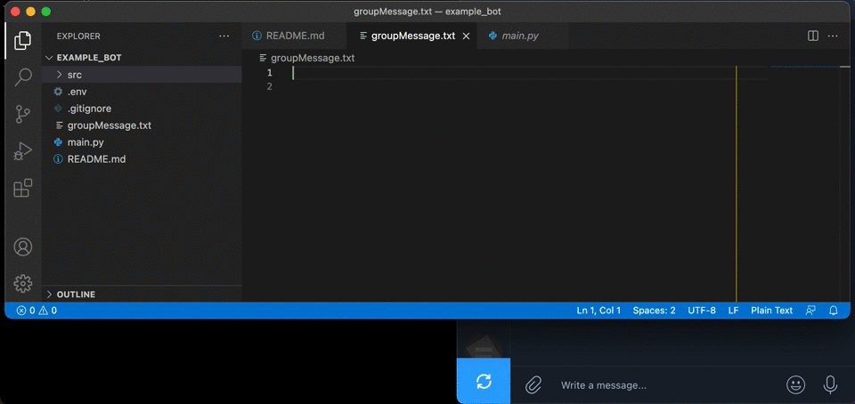

# Telegram Group Messaging Bot

A Python CLI for broadcasting a predefined, HTML-formatted message to many Telegram group chats via
the Telegram Bot API, with optional Excel tracking of send results.

**What it does:**
- Author a message once in Markdown → generate Telegram, Element, Slack & email versions in one command
- Broadcast to every group in your list, with per-send progress and a summary
- Resume safely after interruptions and flag uncertain deliveries
- Optionally record delivery outcomes in an Excel tracker

## Quick Start — Sending a Message (do this every time)

Assumes the one-time [Setup](./docs/setup.md) (clone + virtualenv + `.env` bot token) is done.

```bash
# 1. Go to the project folder
cd telegram-bot

# 2. Activate the virtual environment
source env-telegram-bot/bin/activate

# 3. Write your message (this is the ONLY content file you edit)
#    Open files/message.md and write it in Markdown.
#    # Title → subject/bold, ## Section → header, **bold**, [label](url), - bullet

# 4. Generate the Telegram (and Element/Slack/email) versions
python3 format_message.py          # writes files/out/telegram.html + siblings

# 5. Set the recipient groups (the bot ONLY reads files/groups.txt)
#    Format per line:  -1001234567890, Group Name
cp files/groups-test.txt files/groups.txt   # test group only — do this first!
#    ...then edit files/groups.txt with the full list when the test looks right

# 6. Send (previews the message + group list and asks you to confirm)
python3 main.py

# 7. Done
deactivate
```

**The four inputs:**

| What | Where |
|------|-------|
| Message content | Edit `files/message.md`, then run `python3 format_message.py` |
| Recipient groups | Lines in `files/groups.txt` |
| Bot token | `.env` (set once) |
| Send | `python3 main.py` |

> **Always test first:** put only your test group in `files/groups.txt` and send once to check
> formatting before copying in the full list.

## Additional functionality

Each is summarized here; follow the link for full details.

- **Multi-channel formatting** — one Markdown source → Telegram / Element / Slack / email outputs.
  → [Message Formatting](./docs/message-formatting.md)
- **Resume after interruption** — progress is saved after every send; on the next run you can skip
  already-sent groups and send only the remaining ones. → [Sending & Results](./docs/sending-and-results.md#resume-after-an-interruption)
- **Timeouts & uncertain-delivery flagging** — sends time out instead of hanging; a send that times
  out after being sent is flagged `⚠ CHECK MANUALLY` and never blindly re-sent.
  → [Reliability](./docs/sending-and-results.md#reliability-timeouts-retries--uncertain-delivery)
- **Excel tracking** — record `Yes`/`No` delivery outcomes to a spreadsheet, during or after a send.
  → [Excel tracking](./docs/sending-and-results.md#updating-excel-tracking-standalone)

## Documentation

| Guide | Covers |
|-------|--------|
| [Setup & Bot Configuration](./docs/setup.md) | Prerequisites, install, BotFather token, `.env` |
| [Message Formatting](./docs/message-formatting.md) | Authoring `message.md`, multi-channel output, Telegram HTML, pre-send checks |
| [Recipient Groups](./docs/recipients.md) | `groups.txt` format, adding the bot to a new group, `getUpdates` |
| [Sending & Results](./docs/sending-and-results.md) | Running the script, resume, reliability, Excel tracking |
| [Troubleshooting & Maintenance](./docs/troubleshooting.md) | Common errors, dependency upkeep |

## Project Structure

```
telegram-bot/
├── main.py                # Entry point — message broadcasting flow (with resume)
├── format_message.py      # Render message.md into Telegram/Element/Slack/email formats
├── update_excel.py        # Standalone Excel tracking update
├── .env                   # Bot API key (not committed)
├── requirements.txt       # Python dependencies
├── docs/                  # Detailed guides (see table above)
├── files/
│   ├── message.md         # Canonical message source (Markdown) — the one file you edit
│   ├── out/               # Generated per-channel formats; the bot sends out/telegram.html
│   │                      #   (also: element.md, slack.txt, email.txt)
│   ├── groups.txt         # Target group chat IDs and names
│   ├── groups-test.txt    # Test-only recipient list
│   ├── last_send_results.json     # Auto-saved delivery results (gitignored)
│   ├── last_send_ambiguous.json   # Uncertain-delivery flags (gitignored)
│   └── External Partners Channels.xlsx  # Tracking spreadsheet
└── src/
    ├── colors.py          # Terminal color definitions
    ├── userConfirmation.py # Yes/no prompt utility
    ├── apiRequests.py     # Telegram API send logic (timeouts, retries, results)
    └── excelUpdater.py    # Excel read/write logic
```

## Demo


